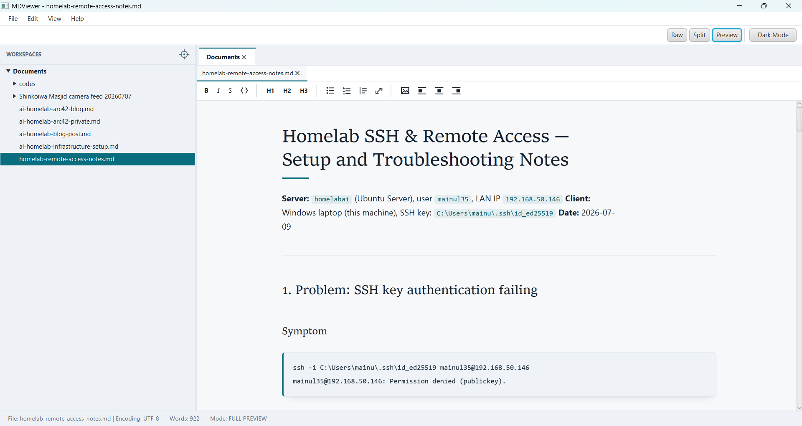

# MDViewer



Professional Markdown desktop application built with JavaFX.

## Download

**Latest Release:** [MDViewer v1.0.0 Early Access](https://github.com/mainul35/markdown-viewer/releases/latest)

1. Download `mdviewer-1.0.0-EA-release.zip` from the Releases page
2. Extract the zip file
3. Run: `java -jar mdviewer-1.0.0-EA.jar`

> **Note:** Requires JDK 21 or higher. See installation instructions below.

## Prerequisites

- **JDK 21 or higher** (Download from https://adoptium.net/)
- **Maven 3.6+** (Download from https://maven.apache.org/)

## Installation

1. Install JDK 21 from https://adoptium.net/temurin/releases/?version=21
2. Verify Java installation:
   ```bash
   java -version
   javac -version
   ```
3. Install Maven (if not already installed):
   ```bash
   choco install maven
   ```
   Or download from https://maven.apache.org/download.cgi

## Building the Project

```bash
mvn clean compile
```

## Running the Application

### Option 1: Maven
```bash
mvn javafx:run
```

### Option 2: Standalone jar
```bash
mvn clean package
java -jar target/mdviewer-1.0.0.jar
```

### Option 3: Open file directly
```bash
java -jar target/mdviewer-1.0.0.jar file.md
```

## Distribution

`mvn clean package` (or `package.bat` / `package.ps1`) produces **one self-contained jar**:
`target/mdviewer-1.0.0.jar`, roughly 57 MB. Everything it needs is inside it — JavaFX
(including its native `.dll`s), commonmark, PlantUML with its C4 standard library, and the
mermaid bundle. The target machine needs only a JRE 21; no JavaFX SDK, no Graphviz, and no
internet connection.

Two consequences of that packaging worth knowing:

- **The jar is platform-specific.** It embeds the JavaFX natives for the OS it was built on,
  so a jar built on Windows runs on Windows. Build on each OS you intend to ship to.
- **`Launcher` is the manifest main class, not `MainApp`.** The JVM refuses to start a main
  class that extends `javafx.application.Application` when JavaFX is on the classpath, which
  is exactly the situation inside a shaded jar. `Launcher` is a plain class that calls into
  `MainApp`, which sidesteps that check. Do not "simplify" the manifest to point at `MainApp`.

**Close the app before packaging.** A running MDViewer holds `target/mdviewer-1.0.0.jar`
open, and Windows will not let the build overwrite or delete it. Maven reports that as
`Failed to clean project` or `Could not create modular JAR file`, neither of which
mentions the real cause, so `package.bat`/`package.ps1` check for it first and say so
plainly. Note the app runs as **javaw.exe**, so it does not appear if you go looking for
`java` in Task Manager.

`run.bat` deliberately does not `clean` — running from source has no business deleting
the packaged jar, and doing so made the script fail whenever the app happened to be open.

The startup warning `Unsupported JavaFX configuration: classes were loaded from 'unnamed
module'` is expected and harmless — it is JavaFX noting that it is running from the classpath
rather than the module path.

## Features

- **Workspaces:** a workspace is a folder. Opening a file adopts its folder as a workspace;
  opening another file from anywhere inside that folder joins the same one, while a file
  from elsewhere starts a second workspace. **File → Open Folder...** adds one directly.

- **Workspace explorer** (left panel): a markdown-only file tree over every open workspace.
  It lists `.md`, `.markdown` and `.txt` files, and only those folders with markdown
  somewhere inside them — everything else (build output, images, dot-directories) is hidden,
  at the workspace root as well as further down. Directories are read only when first
  expanded, so adding a workspace containing `target/` or `node_modules/` does not stall the
  UI. Double-click a file to open it. The crosshair button in the panel header — or
  **View → Reveal Current File** — expands the tree down to the document you are editing and
  scrolls to it, which is the point of it when a workspace holds hundreds of files.
  **View → Hide Explorer** collapses the panel.

- **Workspace refresh:** the explorer caches directory listings, so a file written outside
  the app — by a build, a `git pull`, or another editor — would otherwise stay invisible
  until you collapsed and re-expanded its folder. **View → Refresh Workspaces** (F5) and
  *Refresh workspaces* on the explorer's right-click menu re-read it on demand, and
  **Settings → Auto-refresh Workspaces** does the same every 5 minutes. The toggle is on by
  default and is a toggle because a workspace on a network share is exactly where the scan
  stops being free.

  The refresh is a merge, not a reload: folders that are still there keep their identity, so
  your expanded folders stay expanded and your selection stays selected. Only directories
  already read are re-read, so refreshing never forces the lazy tree to load anything.

- **Two-level tabs:** workspace tabs on top, and under each one only the files belonging to
  that workspace. Many open files stay legible because they are grouped by origin instead of
  forming one long strip. Each document keeps its own editor, so undo history and caret
  position survive tab switches; a single shared editor/preview area is moved into whichever
  file tab is selected, so there is still only one WebView no matter how many files are open.
  At most **10 workspace tabs** and **20 file tabs per workspace** can be open at once; past
  that, opening is refused with a status-bar message rather than silently closing something
  you still had open.

- **Find and replace** in the raw editor: **Ctrl+F** to find, **Ctrl+H** to find and
  replace, both under the Edit menu. Enter and Shift+Enter step through matches, `Aa`
  toggles case sensitivity, Esc closes. Matching is plain text rather than regex, because
  Markdown is full of characters that are regex metacharacters and typing a literal `*` or
  `[` should find that character. Replace All is one edit, so it undoes in a single step.
  Invoking find from Full Preview drops back to Split so there is an editor to search.

- **Design:** a "drafting plate" direction, chosen for the job this tool actually does —
  long architecture documents read for an hour at a time. Cool vellum rather than warm
  cream, a blueprint-teal accent, Sitka for headings against Segoe UI body text, and a
  prose column held to a readable measure while code, tables and diagrams break out of it.
  Fenced code blocks are presented as labelled plates captioned with their own language
  tag; diagrams share the same plate family. All fonts are system faces — this is an
  offline app, so a webfont would simply fail to load.

- **Formatting from the preview:** a toolbar above the rendered document applies bold,
  italic, strikethrough, inline code, headings, lists, quotes, links and images without
  needing to remember the Markdown for them. The same actions are on the preview's
  right-click menu, which replaces WebKit's Copy-only one.

  Selecting text in the *preview* and pressing a button edits the *source*. Every rendered
  element carries the offsets of the Markdown it came from, and a selection reports which
  occurrence of that text it is within its element, so the second "hello" in a paragraph is
  the one that gets styled. A selection spanning existing formatting cannot be matched back
  and says so rather than guessing. With no preview selection the buttons fall back to the
  editor's own selection, which is what makes them useful in Split mode.

- **Table designer:** the table button on the preview toolbar opens a size picker.
  Drag across the grid for the usual small table, or type exact numbers for one bigger
  than the grid offers — up to 100 x 30. Sizes count the header row, so 3 x 4 is a
  header plus two body rows.

  The table is written as aligned GFM, placed after the caret's line rather than at the
  caret — a table spliced into the middle of a paragraph is not a table, since GFM needs
  it to start at a line boundary — with blank lines added on either side only where one
  is not already there. The first header cell is selected, so typing replaces it.

- **Print and export to PDF:** the print button on the right of the preview toolbar
  opens the system print dialog, so any installed printer works — including *Microsoft
  Print to PDF*, which is how you get a PDF. The page prints as the preview renders it,
  with a print stylesheet that adjusts what does not belong on paper.

  - **Header and footer space** is consistent on every page. It is the print job's page
    margin (72pt top and bottom against 54pt at the sides) rather than drawn content,
    because JavaFX's WebKit does not implement `@page` margin boxes — so the band is
    reliably there and reliably empty. There is no page numbering for the same reason.
  - **Images and diagrams are never cut in half.** A figure that does not fit in the
    remaining space moves to the next page whole.
  - **Tables do split across pages, and the header row repeats** on each one, so you
    never scroll back to find out what a column was. This needs the preview's
    `display:block` table — the thing that lets a wide table scroll sideways on screen —
    to be undone for print: a block table has no header group to repeat and no rows to
    break between, and would be cut mid-row.
  - Code wraps instead of running off the right edge, dark mode prints as the light
    palette, and shadows are dropped.

- **Images from the preview:** *Insert image* copies the chosen file into `assets/` beside
  the document and inserts a relative reference — copying rather than linking in place is
  what keeps the document portable. Right-click an image in the preview for its own menu:
  resize (75/100/125/150%), position (left/centre/right), crop, caption, replace, copy path
  and remove. Markdown has no syntax for size, position or captions, so a styled image is
  written as an `` in an aligned paragraph — or a `<figure>` when it has a caption —
  the forms that also render on GitHub. Returning it to 100% width, left alignment and no
  caption turns it back into plain `` Markdown, so the HTML never accumulates.

- **Files from the explorer:** right-click any row for New file, New folder, Rename and
  Delete, plus Open on a file. Deletions go to the recycle bin. Renaming moves any open
  document with the file, so the next save does not write it back under the old name. A
  workspace root offers creation only — renaming or binning it would leave the workspace
  pointing at nothing; use **File → Close Workspace** instead.

- **Three Editing Modes:**
  - Raw Mode: Plain text editor for Markdown
  - Split Preview: Side-by-side editor and live preview
  - Full Preview: Distraction-free rendered view

- **Dark / light theme:** toggled from the toolbar or **View → Dark Mode**. One switch
  themes the JavaFX chrome and the preview document together. The preview carries both
  palettes and flips a `data-theme` attribute, so switching costs no reload and keeps your
  scroll position. Diagram cards deliberately stay light in dark mode — PlantUML and mermaid
  bake dark strokes and text into their SVG, which would be invisible on a dark card.
  The theme is not persisted between runs; the app always starts in light mode.

- **Toolbar:** file actions live only in the File menu, since duplicate buttons added no
  quick access the menu did not already provide. The mode buttons stay (mode switching is
  frequent) and sit on the right, next to the theme switch.

- **Responsive window:** the window opens at 85% of the screen's *visual* bounds (the work
  area, excluding the taskbar) and is centred there, with a 900x600 floor that is itself
  clamped so it can never exceed a smaller screen. It scales from a 1024x600 netbook up to
  4K. Window position and size are not remembered between runs.

- **File Operations:**
  - Open/Save `.md`, `.markdown`, `.txt` files
  - UTF-8 encoding support
  - Unsaved changes detection

- **Live Preview:**
  - Real-time Markdown rendering, debounced so typing stays responsive
  - GitHub-style CSS theme
  - Support for tables, code blocks, blockquotes
  - Preview scroll position is preserved while editing, and each document remembers its
    own position — switching tabs or following a link and coming back resumes where you
    were rather than jumping to the top
  - Web links open in the system browser instead of hijacking the preview pane

- **Following links between documents:** a relative link to another Markdown file
  (`[rules](.claude/rules/code-style.md)`) opens that file as a new tab in the right
  workspace and reveals it in the explorer, expanding the folders on the way. This works
  for Markdown links and raw HTML `<a href>` alike. A file reached this way is surfaced in
  the tree even if the markdown-only filter would normally hide its folder — a document you
  deliberately opened is not the noise the filter exists to remove. Links to non-Markdown
  files are reported in the status bar rather than opened; the app never launches arbitrary
  local files.

- **Diagrams:**
  - ` ```mermaid ` fences render through the bundled mermaid build. The supported
    diagram types are:

    | Type | Opening keyword |
    |---|---|
    | Flowchart | `flowchart TD` |
    | Sequence | `sequenceDiagram` |
    | Class | `classDiagram` |
    | State | `stateDiagram-v2` |
    | Entity relationship | `erDiagram` |
    | Gantt | `gantt` |
    | Mindmap | `mindmap` |
    | Git graph | `gitGraph` |

    **Beta diagram types are not supported** — `block-beta`, `sankey-beta`,
    `xychart-beta` and anything else mermaid marks as beta. The bundled mermaid is
    pinned to 10.9.3 (see the table below for why it cannot be upgraded), and the
    beta grammars are the part of mermaid that moves between releases
  - ` ```plantuml ` (also `puml`, `uml`) fences render to inline SVG, on a background
    thread so large diagrams never freeze the UI
  - a bare `@startuml` … `@enduml` block renders without a fence too — those are
    PlantUML's own delimiters, so a fence adds nothing. The block has to be
    unbroken: a blank line inside one, or `*` bullet syntax such as `@startmindmap`,
    is read as Markdown and still needs a fence
  - an unfenced Mermaid diagram renders when its opening keyword is unambiguous —
    the eight types above, plus `quadrantChart` and `requirementDiagram`. `pie`,
    `journey` and `timeline` are excluded on purpose, because a paragraph of prose
    could genuinely start with them; those need a fence. `flowchart` and `graph`
    have to carry a direction (`flowchart TD`) for the same reason
  - C4-PlantUML diagrams work offline: `!include` URLs pointing at the C4-PlantUML GitHub
    repo are rewritten to the C4 standard library bundled inside the PlantUML jar
  - No Graphviz install needed — PlantUML's pure-Java `smetana` layout engine is used
  - Rendered diagrams are cached by source, so editing prose does not re-render them

- **Images:**
  - Relative image paths resolve against the directory of the file being viewed, for both
    Markdown `` images and raw HTML `` tags
  - Absolute `http(s):`, `data:` and `file:` URLs are left untouched

## Project Structure

```
MDViewer/
├── src/
│   ├── main/
│   │   ├── java/
│   │   │   ├── com/mdviewer/
│   │   │   │   ├── MainApp.java              # JavaFX Application
│   │   │   │   ├── Launcher.java             # Entry point for the shaded jar
│   │   │   │   ├── MainController.java       # UI + workspace/preview orchestration
│   │   │   │   ├── service/
│   │   │   │   │   ├── MarkdownService.java  # Markdown -> HTML, diagrams, image paths
│   │   │   │   │   └── DiagramService.java   # PlantUML -> SVG, off-thread + cached
│   │   │   │   └── ui/
│   │   │   │       ├── FileTreePanel.java    # Explorer + reveal-in-tree target
│   │   │   │       ├── PathTreeItem.java     # Lazily loaded file-tree node
│   │   │   │       ├── WorkspaceView.java    # A workspace and its file tabs
│   │   │   │       └── DocumentView.java     # One open document + its editor
│   │   │   └── module-info.java              # Java module configuration
│   │   └── resources/
│   │       ├── fxml/main.fxml                # UI layout
│   │       ├── css/styles.css                # Application styles
│   │       └── js/mermaid.min.js             # Bundled mermaid renderer
├── pom.xml                                   # Maven build configuration
├── package.bat / package.ps1                 # Build the standalone jar
├── run.bat / run.ps1                         # Run from source
└── project_plan.md                           # Development roadmap
```

## Third-party components

| Component | Version | Licence | Why it is pinned |
|---|---|---|---|
| JavaFX | 21 | GPLv2 + Classpath Exception | UI toolkit and WebView |
| commonmark-java | 0.21.0 | BSD-2-Clause | Markdown parsing (+ GFM tables) |
| PlantUML | 1.2026.6 (`plantuml-mit`) | MIT | The MIT-licensed build is used deliberately, to match this project's licence |
| mermaid | 10.9.3 | MIT | **Do not upgrade to 11.x** — it uses JavaScript syntax that JavaFX's WebKit 615.1 cannot parse, and mermaid silently stops loading |

## Development Roadmap

- ✅ **Phase 1:** Foundation & Shell (Project setup, Main Window, Basic Open/Save)
- ✅ **Phase 2:** The Markdown Engine (Parser implementation, CSS Theme)
- ✅ **Phase 3:** Mode Logic & Workspace (Raw Editor, Split View sync, Full Preview toggle)
- ✅ **Phase 4:** Toolbar Bridge & GUI Editor (Toolbar integration, JS bridge logic, formatting actions)
- ✅ **Phase 5:** OS Deployment & Polishing (Workspace management, file operations, find/replace, dark mode, diagram rendering)
- ⏳ **Native Packaging:** Bundle JRE for true double-click execution without requiring Java installation

## License

MIT
