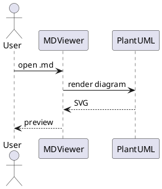

# Test Markdown File

## Overview

This is a **test** file to verify the _MDViewer_ application.

### Features

- Bold text
- Italic text
- `Inline code`

### Code Block

```java
public class Hello {
    public static void main(String[] args) {
        System.out.println("Hello, World!");
    }
}
```

### Table

| Column 1 | Column 2 | Column 3 |
|----------|----------|----------|
| A        | B        | C        |
| D        | E        | F        |

### Blockquote

> This is a blockquote.
> Multiple lines supported.

### Links

[Visit GitHub](https://github.com)

### Mermaid Diagram


### PlantUML Diagram


