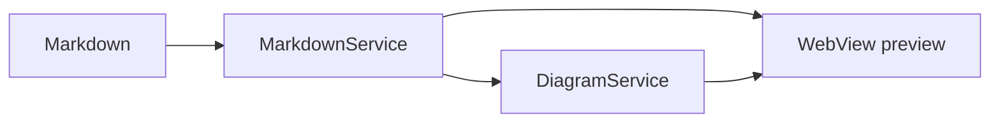
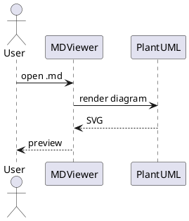

# Test Markdown File

## Overview

This is a **test** file to verify the _MDViewer_ application.

### Features

- Bold text
- Italic text
- `Inline code`

### Code Block

```java
public class Hello {
    public static void main(String[] args) {
        System.out.println("Hello, World!");
    }
}
```

### Table

| Column 1 | Column 2 | Column 3 |
|----------|----------|----------|
| A        | B        | C        |
| D        | E        | F        |

### Blockquote

> This is a blockquote.
> Multiple lines supported.

### Links

[Visit GitHub](https://github.com)

### Mermaid Diagram



### PlantUML Diagram



## Charts

A ` ```chart ` fence is compiled into an SVG. Settings come first, then a line of three
dashes, then the rows. `type:` is the only one that is required.

Every chart below is live — right-click one to change its form, and the toolbar's chart
button inserts a new one with example data already in it.

### Bar — comparing named things

Long labels stay horizontal and readable, which is what a bar chart is for. One series
gets one colour: the length already says which is biggest, so colouring each bar
differently would spend the only free channel saying it twice.

```chart
type: bar
title: Slowest endpoints
unit: ms
---
POST /api/tenants        | 412
GET /api/clients         | 208
POST /api/clients/rotate |  96
GET /api/health          |  14
```

### Column — comparing across a few steps

Several values on a row make it a series, plotted against `x:`. Two series get a legend;
one series does not, because the title already names it.

```chart
type: column
title: Requests handled
unit: req/s
x: Mon, Tue, Wed, Thu, Fri
---
auth    | 120, 140, 131, 128, 96
gateway | 340, 352, 377, 361, 289
```

### Line — change over time

```chart
type: line
title: Response time by percentile
unit: ms
x: 09:00, 10:00, 11:00, 12:00, 13:00, 14:00
---
p50 | 12, 14, 11, 13, 12, 12
p95 | 40, 52, 47, 61, 55, 44
p99 | 88, 104, 96, 131, 118, 92
```

### Area — change over time, with the total emphasised

The fill is a wash at 10%, never a saturated block: it is there to say "this is a total",
not to shout.

```chart
type: area
title: Documents indexed
x: Jan, Feb, Mar, Apr, May, Jun
---
total | 120, 180, 165, 240, 232, 301
```

### Pie — parts of a whole

Six slices is the limit. Past that the small ones cannot be told apart, so a seventh is
refused rather than drawn — see the last section.

```chart
type: pie
title: Storage by kind
---
documents | 60
images    | 30
diagrams  | 10
```

### Donut — the same, with room in the middle

```chart
type: donut
title: Where the answer time goes
unit: ms
---
reading sources | 420
model latency   | 1180
rendering       | 90
```

### Stat — one number that matters

A single number plotted as one bar says less than the number would on its own. `delta:`
adds the change line under it.

```chart
type: stat
title: Documents in this workspace
unit: files
delta: +12% vs last week
---
total | 1284
```

### When the form does not fit the data

Some forms mislead on some data. A pie past six slices cannot be read; a stat tile shows
one number and would throw the rest away. Rather than refuse, the chart is drawn in the
nearest form that works and a line underneath says what changed — so the rule holds and
you still get your chart.

Seven slices, asked for as a pie:

```chart
type: pie
title: Requests by endpoint
---
tenants   | 412
clients   | 208
rotate    | 96
health    | 14
sessions  | 61
tokens    | 38
audit     | 22
```

A type that does not exist here, drawn as what the data wants to be:

```chart
type: sunburst
title: Storage by kind
---
documents | 60
images    | 30
diagrams  | 10
```

The same applies to a line with one point, an area stacked more than three deep, a pie
with a negative value, and a stat with more than one number.

### The two it will not draw

Only two rules cannot be met by changing the form, because meeting them would mean
discarding data. Both say so and keep the numbers on screen.

More series than there are colours to tell them apart:

```chart
type: column
title: Nine services
x: Mon, Tue
---
one   | 1, 2
two   | 2, 3
three | 3, 4
four  | 4, 5
five  | 5, 6
six   | 6, 7
seven | 7, 8
eight | 8, 9
nine  | 9, 10
```

And a chart with nothing in it yet:

```chart
type: bar
title: Nothing here yet
```
